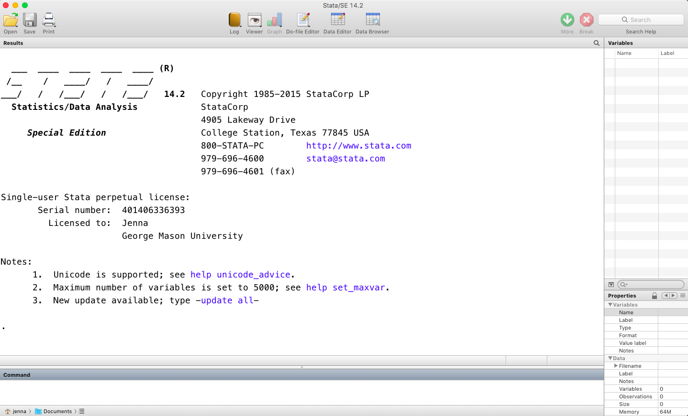
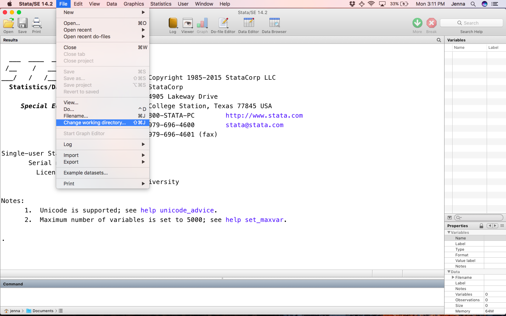
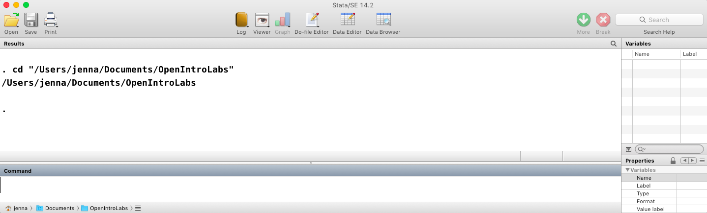

```{r global_options, include=FALSE}
library(statamd)
statapath = statamd::stata_engine_path()
write_stata_old('arbuthnot.dta')
profile_do(dataset = "arbuthnot.dta")

knitr::opts_chunk$set(eval = FALSE, engine = "stata", engine.path = statapath, comment = "")

library(dplyr)
library(ggplot2)
#library(oilabs)
```


## The Stata Interface

Welcome to OpenIntro Labs using Stata!  Stata is a program for statistical computing that will allow you to interact with data and apply the statistical methods you learn in the OpenIntro Statistics course.  This first lab will provide an introduction to Stata, including the interface, getting data into Stata, and some basic commands.

You can apply statistical methods in Stata using either the drop-down series of menus or using some programming.  These labs will focus on teaching programming skills using Stata. 

This lab assumes that you have already installed Stata.  Stata is available for purchase at <http://www.stata.com>.  You may also wish to see whether your university has Stata licenses available for your use.

First, launch Stata as you would with any program on your computer.  The first screen you see should look something like this:



<br>

You will notice several areas of the screen.  The bottom rectangle is the *Command window*, where you can enter Stata code interactively (or "on the fly'') that you wish to run.  The results will display in the *Results window* above the command line.  When you open Stata, the Results window displays information about the version of Stata that you are running.  

The right panel summarizes what information, for example data, is currently available to work with in Stata. In this screen above, we do not have any data or information loaded into Stata, so that area is blank.   

<!--- This information obtained from:
http://www.stata.com/features/overview/graphical-user-interface/ -->


<!--- Perhaps add this back in? 
### Creating a reproducible lab report

We will be using R Markdown to create reproducible lab reports. See the
following videos describing why and how:

[**Why use R Markdown for Lab Reports?**](https://youtu.be/lNWVQ2oxNho)
<iframe width="560" height="315" src="https://www.youtube.com/embed/lNWVQ2oxNho" frameborder="0" allowfullscreen></iframe>

[**Using R Markdown for Lab Reports in RStudio**](https://youtu.be/o0h-eVABe9M)
<iframe width="560" height="315" src="https://www.youtube.com/embed/o0h-eVABe9M" frameborder="0" allowfullscreen></iframe>
-->


### Working directory

Each time you open Stata, it is a good idea to know where your *working directory* is set to.  The *working directory* is where Stata looks for Stata-related files, such as datasets or code.  We recommend creating a folder for your labs on your computer and setting your working directory there. You should save all datasets for these labs in this folder.

You can view the current working directory by looking at the bottom of the screen:


<br>

You can also check the current working directory by typing `pwd` into the *Command window* and pressing enter.  


<br>

If your *working directory* is not set to where you would like Stata to look, you can change this to another folder on your computer.  You can set the working directory through the dropdown menu:


<br>

You can also set the working directory using the command "cd" followed by the path on your computer.


<br>

### Do-files

In Stata, you can enter code interactively ("on the fly") in the *Command window*.  We have shown this above with the `pwd` and `cd` commands.  You can also save your code in a separate file called a do-file.  It is always better to save code in a separate do-file because:

- You can save your code cleanly.
- You can annotate your code with comments explaining what you were trying to do.
- You can easily share your work with others.

In these labs, you should always use a do-file to record any code that you create.  To create a new do-file, select the button at the top corresponding to Do-file Editor:


<br>


Or choose file -> new -> do file editor from the drop down menu.


<br>


Using either approach, a new window will open that is your do-file.  Save this file to wherever you would like to store your code for this lab.  

When you type commands into your do-file, they will not automatically run when you press enter.  Highlight the code you wish you run in your do-file, and click the "do" button on the top right to send your code to Stata.


<br>

Once you highlight and click the "do" button, the Stata results window will show the command and any output.  You can also use a keyboard shortcut to run code in your do-file:

- Windows: Type ctrl-D (control button-letter D)
- Mac: Type command-shift-D  


## Dr. Arbuthnot's Baptism Records

### Loading data into Stata

In this lab, we will use a datafile called arbuthnot.dta. Datafiles with the extension ".dta" are Stata datafiles, and they are the easiest to read into Stata.  All of the following assume that Stata is available on your computer.  There are three options for reading .dta datafiles into your computer:

- Double click the dataset in your file folder on your computer.
- Choose file -> open and select the file folder on your computer.
- Using Stata code in your do-file.

We will focus on the last option because it is "reproducible" in the sense that others can see from your do-file what dataset you have loaded.  First, open up a new do-file using the instructions above and save it to a folder called "Lab-dofiles" within your *OpenIntroLabs* folder.  From now on, we assume that you type the given code into your do-file and save it there.  

Make sure your working directory is set to your OpenIntroLabs folder, and that the dataset "arbuthnot.dta" is within this folder.  Then enter the following into your do-file and run the code: 


```{r load-abrbuthnot-data, eval=F}
use "arbuthnot.dta"
```


You'll notice that Stata does not provide any feedback, other than repeating the code you wrote in the *Results window*.  If you do no receive an error in red font, the data likely has been loaded into Stata.

Once the dataset is loaded, there will be additional information in the *Variables window* in the top right corner.  Specifically, we see three variables: year, boys, girls.  If you click on each variable in the top right, information about the variable is presented in the *Properties window* in the bottom right.  Additionally, if you scroll down in the *Properties window*, you can see information about the Arbuthnot baptism data, including the number of variables (3) and the number of observations (82).

### Background on Arbuthnot baptism data

<!-- Directly from original OpenIntro lab: Okay?-->


The Arbuthnot data set refers to Dr. John Arbuthnot, an 18<sup>th</sup> century 
physician, writer, and mathematician. He was interested in the ratio of newborn
boys to newborn girls, so he gathered the baptism records for children born in
London for every year from 1629 to 1710. 

### Interacting with data

To view the dataset in Stata, you can click the "Data Browser" button at the top of Stata.


<br>

Here, you can see the three variables again: year, boys, and girls.  Each row represents a different year, starting with 1629 and ending with 1710, for a total of 82 observations.  The columns "boys" and "girls" indicate the number of boys and girls baptized in each year, respectively.   


## Some Exploration

Going back to your Stata do-file, the command `codebook` provides a summary for each variable in your dataset.  This is not recommended for variables with many (hundreds of variables), but will be sufficient here.  

```{r, eval = FALSE}
codebook
```

If we would like to only look at information about one variable, we could follow `codebook` with the variable of interest, e.g. girls.

```{r, eval = TRUE}
codebook girls
```

1. What command would you use to extract just information about boys baptized? Try
    it!

### Data visualization

In Stata, the `scatter` command gives a simple plot of the number of girls baptized per year.

```{r plot-girls-vs-year2, eval = TRUE, echo = 1, results = "hide"}
scatter girls year
graph export "girls.png", replace
```


<br>


You will notice that the first variable, girls, appears first in the command, and also appears on the y-axis.  The second variable, year, appears second in the command, and appears on the x-axis.  We can modify the plot using options in Stata.  Options in Stata are frequently specified after the main command and are preceded by a comma.  For example, if we wanted to change the color of the plotted points to red, we would type: 

```{r plot-girls-vs-yearred, eval = F}
scatter girls year, mcolor("red")
```

To read about all the options available for scatterplots, you can access the help files by typing into Stata `help scatter`.

2. Is there an apparent trend in the number of girls baptized over the years? 
How would you describe it? (To ensure that your lab report is comprehensive,
be sure to include the code needed to make the plot as well as your written
interpretation.)


### Stata as a calculator

We can also use Stata to compute mathematical expressions, just like a calculator.  We only need to precede our mathematical expression with the command `display` to make Stata do computations.  For example, if we want to see the total number of baptisms in 1629, we could type:

```{r calc-total-bapt-numbers}
display 5218 + 4683
```

### Adding a new variable to the data frame


Alternatively, we could create a new variable corresponding to the sum of boys and girls using the `generate` command:


```{r calc-total-bapt-vars}
generate total = boys + girls
```

After running the `generate` command, open up the *Data Browser* and verify the new variable, total, is added to the dataset.  We can make a plot of the total number of baptisms per year with the command:

```{r plot-total-vs-year}
scatter total year
```

Similarly to how we computed the total number of births, we can compute the ratio 
of the number of boys to the number of girls baptized in 1629 with

```{r calc-prop-boys-to-girls-numbers}
display 5218 / 4683
```

or we can add a new variable that contains all the ratios by using the command `generate`:

```{r calc-prop-boys-to-girls-vars}
generate ratio = boys / girls
```

We can also compute the proportion of newborns that are boys in 1629:

```{r calc-prop-boys-numbers}
display 5218 / (5218 + 4683)
```

or this may also be computed for all years simultaneously and appended to the dataset:

```{r calc-prop-boys-vars}
generate boyratio = boys / total
```

Note that we are using the new `total` variable we created earlier in our calculations.

3. Now, generate a plot of the proportion of boys born over time. What do you see? 

Finally, in addition to simple mathematical operators like subtraction and 
division, you can ask Stata to make comparisons like greater than, `>`, less than,
`<`, and equality, `==`. For example, we can ask if boys outnumber girls in each 
year with the expression

```{r boys-more-than-girls}
generate moreboys = boys > girls
```

This command add a new variable to the `arbuthnot` dataframe containing the values
of either 1 if that year had more boys than girls, or 0 if that year 
did not (the answer may surprise you). 

* * *

## More Practice

In the previous few pages, you recreated some of the displays and preliminary 
analysis of Arbuthnot's baptism data. Your assignment involves repeating these 
steps, but for present day birth records in the United States. First, save the "present.dta" dataset to your OpenIntroLabs folder.  Then you will need to clear the current dataset from Stata using the command `clear`.  At this stage, you should have saved all your code in a do-file, and you do not need to save your datafile.  Load the present day data with the following command.


```{r load-present-data, eval = F}
clear
use "present.dta"
```


The data are stored in a data frame called `present`.

4.  What years are included in this data set? What are the dimensions of the 
    data frame? What are the variable (column) names?

5.  How do these counts compare to Arbuthnot's? Are they of a similar magnitude?

6.  Make a plot that displays the proportion of boys born over time. What do you see? 
    Does Arbuthnot's observation about boys being born in greater proportion than girls 
    hold up in the U.S.? Include the plot in your response. *Hint:* You should be
    able to reuse your code from Exercise 3 above, just replace the dataframe name.

7.  In what year did we see the most total number of births in the U.S.? *Hint:*
    First calculate the totals and save it as a new variable. Then, sort your
    dataset in descending order based on the total column. You can do this
    by running the command `sort total`. 

<!-- 
How to do this in Stata?
These data come from reports by the Centers for Disease Control. You can learn more about them
by bringing up the help file using the command `?present`.
-->

<div id="license">
This is a product of OpenIntro that is released under a 
[Creative Commons Attribution-ShareAlike 3.0 Unported](http://creativecommons.org/licenses/by-sa/3.0). 
This lab was adapted for Stata by Jenna R. Krall and John Muschelli and adapted for OpenIntro by Andrew Bray and Mine &Ccedil;etinkaya-Rundel
from a lab written by Mark Hansen of UCLA Statistics.
</div>

* * *

## Resources for learning Stata

This lab is meant to provide you with a brief introduction to Stata.  You may find it helpful to use Google to help you find code.  In addition, there is a useful list of resources at <http://www.stata.com/links/resources-for-learning-stata/>.


```{r, engine='R', include = FALSE, eval = TRUE}
unlink("profile.do")
```
