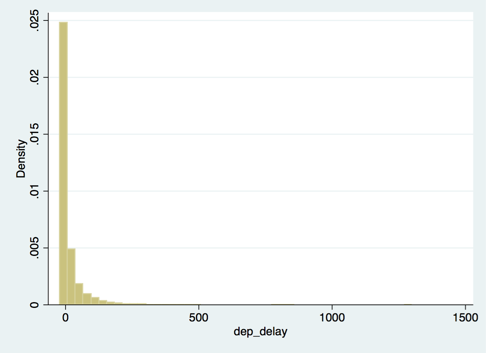
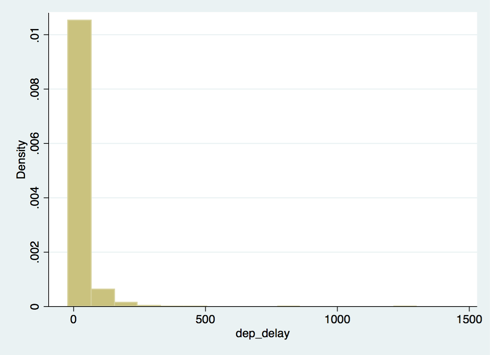
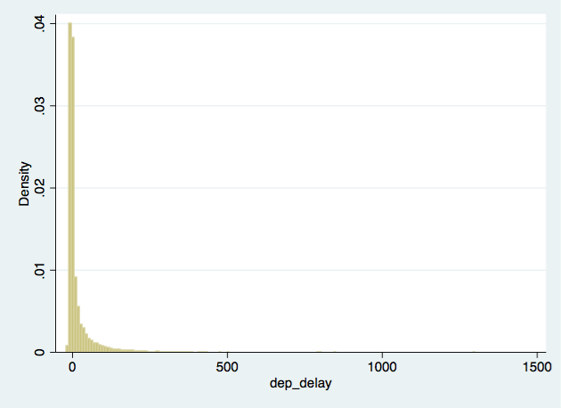
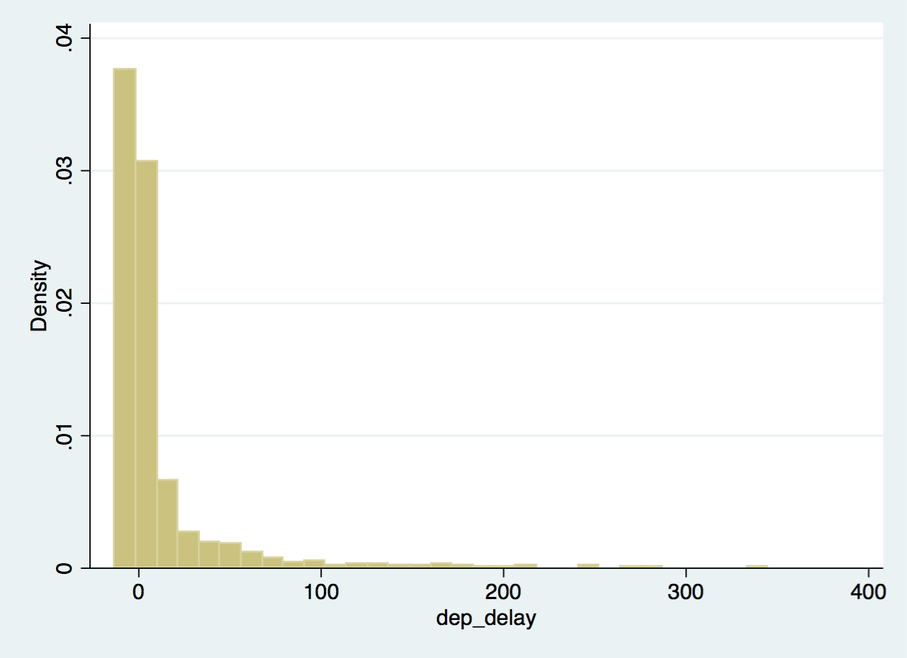
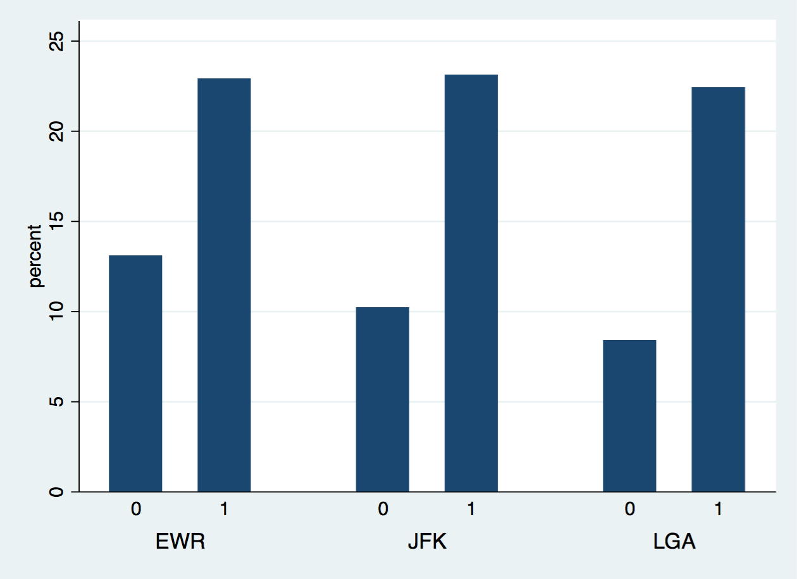
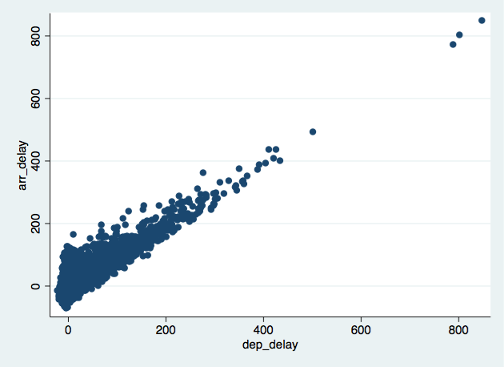

```{r global-options, include=FALSE}
library(statamd)
statapath = statamd::stata_engine_path()
write_stata_old('nycflights.dta')
profile_do(dataset = "nycflights.dta")

knitr::opts_chunk$set(eval = FALSE, engine = "stata", engine.path = statapath, comment = "")

library(dplyr)
library(ggplot2)
library(oilabs)
```

Some define statistics as the field that focuses on turning information into
knowledge. The first step in that process is to summarize and describe the raw
information -- the data. In this lab we explore flights, specifically a random
sample of domestic flights that departed from the three major 
New York City airport in 2013. We will generate simple graphical and numerical 
summaries of data on these flights and explore delay times. As this is a large 
data set, along the way you'll also learn the indispensable skills of data 
processing and subsetting.


## Getting started


### Creating a do-file

Remember to store all your code for each lab in a separate do-files.  Do-files preserve the code for future use so you may reproduce each data analysis you complete.  See Lab 1 for information on creating do-files. 


### The data

The [Bureau of Transportation Statistics](http://www.rita.dot.gov/bts/about/) 
(BTS) is a statistical agency that is a part of the Research and Innovative 
Technology Administration (RITA). As its name implies, BTS collects and makes 
available transportation data, such as the flights data we will be working with 
in this lab.

We begin by loading the dataset `nycflights.dta` data frame. Remember to set your working directory to wherever your `nycflights.dta` is saved.  See Lab 1 for information about working directories.  Type the following in your do-file
to load the data:

```{r load-data}
use "nycflights.dta"
```

Now, open the *Data Browser* to view the dataset.  This dataset is a *data matrix*, 
with each row representing an *observation* and each column representing a 
*variable*. For this data set, each *observation* is a single flight.

The names of the variables appear in the *Variables* window in the top right corner of Stata.  We can also use the `codebook` command alone in Stata to view information about all variables.  Alternatively, we can use `codebook` with a specific variable to view information about one variable.  For example, if we wanted to see information about the months for each flight, we could type:

```{r names, eval = TRUE}
codebook month
```

One of the variables refers to the carrier (i.e. airline) of the flight, which 
is coded according to the following system.

- `carrier`: Two letter carrier abbreviation.
    + `9E`:           Endeavor Air Inc.
    + `AA`:      American Airlines Inc.
    + `AS`:        Alaska Airlines Inc.
    + `B6`:             JetBlue Airways
    + `DL`:        Delta Air Lines Inc.
    + `EV`:    ExpressJet Airlines Inc.
    + `F9`:      Frontier Airlines Inc.
    + `FL`: AirTran Airways Corporation
    + `HA`:      Hawaiian Airlines Inc.
    + `MQ`:                   Envoy Air
    + `OO`:       SkyWest Airlines Inc.
    + `UA`:       United Air Lines Inc.
    + `US`:             US Airways Inc.
    + `VX`:              Virgin America
    + `WN`:      Southwest Airlines Co.
    + `YV`:          Mesa Airlines Inc.


The `nycflights` data frame is a massive trove of information. Let's think about 
some questions we might want to answer with these data:

- How delayed were flights that were headed to Los Angeles?
- How do departure delays vary over months?
- Which of the three major NYC airports has a better on time percentage for 
departing flights?


## Analysis

### Departure delays

Let's start by examing the distribution of departure delays of all flights with a 
histogram.  The function `histogram` in Stata creates a histogram of the variable you select:

```{r hist-dep-delay2, eval = TRUE, echo = 1, results="hide"}
histogram dep_delay
graph export histdelay.png, replace
```





Histograms are generally a very good way to see the shape of a single 
distribution of numerical data, but that shape can change depending on how the 
data is split between the different bins. You can easily define the binwidth you 
want to use by specifying the `bin` option in Stata.


```{r hist-dep-delay-bins15b, eval = TRUE, echo = 1, results="hide"}
histogram dep_delay, bin(15)
graph export histdelay15.png, replace
```





```{r hist-dep-delay-bins150b, eval = TRUE, echo = 1, results="hide"}
histogram dep_delay, bin(150)
graph export histdelay150.png, replace
```



1.  Look carefully at these three histograms. How do they compare? Are features
revealed in one that are obscured in another?

If we want to focus only on departure delays of flights headed to Los Angeles, 
we can use `if` in Stata.

```{r lax-flights-hist, eval = TRUE, echo = 1, results="hide"}
histogram dep_delay if dest == "LAX"
graph export lax.png, replace
```




The `if` condition in Stata allows the command to be restricted to only those observations that meet the `if` criteria.  Therefore, by adding `if dest == "LAX"` we are specifying that we only want to apply the command `histogram dep_delay` only to those observations whose destination is "LAX".  The double-equal (==) implies equality here.  "LAX" is in quotation because it is a character string. 


<div id="boxedtext">
**Logical operators: ** Restricting plots or analyses to a subset of observations that meet certain conditions can allow us to fully examine the data.  To do so we use `if` and a series of 
**logical operators**. The most commonly used logical operators for data 
analysis are as follows:

- `==` means "equal to"
- `!=` means "not equal to"
- `>` or `<` means "greater than" or "less than"
- `>=` or `<=` means "greater than or equal to" or "less than or equal to"
</div>

### Summaries 

We can also obtain numerical summaries for the departure delays using the `summarize` command.

```{r dep-flights-summ, eval = TRUE}
summarize dep_delay
```

Just as in `histogram`, if we want to summarize only one variable, we place it after the `summarize` command.  We can add the Stata option `detail` to obtain more information:

```{r dep-flights-summ2, eval = TRUE}
summarize dep_delay, detail
```

We can also again restrict the summary to only those flights whose destination is LAX.  We do this using the same `if dest == "LAX"` as before.


```{r lax-flights-summ, eval = F}
summarize dep_delay if dest == "LAX"
summarize dep_delay if dest == "LAX", detail
```

We can also use `if` based on multiple criteria. Suppose we are interested in
flights headed to San Francisco (SFO) in February:

```{r}
summarize dep_delay if dest == "SFO" & month == 2
```

Notice that the ampersand (`&`) operator connects two conditions: (1) `dest == "SFO"` and (2) `month == 2`. This means that the only data are summarized where the destination is "SFO" **AND** the month is 2.  If we are interested in either
flights headed to SFO **OR** in February we use the pipe operator (`|`), which indicates "or", instead of the ampersand (`&`), which indicates "and".


1.  Summarize departure delays for flights headed to DCA in March. How many flights meet these criteria? 
    
1.  Describe the distribution of the **arrival** delays of flights headed to DCA     in March using a 
    histogram and appropriate summary statistics. **Hint:** The summary 
    statistics you use should depend on the shape of the distribution.
    
Another useful technique is quickly calculating summary 
statistics for various groups in your data frame. For example, we can modify the above command using the `bysort` prefix to get the same summary stats for each origin airport for flights headed to SFO in February:

```{r summary-custom-list-origin}
bysort origin: summarize dep_delay if dest == "SFO" & month == 2
```

We use `bysort` to first sort the data by `origin` to ensure that all of the same origin flights are grouped together, and then apply summarize by each origin airport.

1.  Find the minimum and maximum for `arr_delay` of flights going to     
    SFO in February, grouped by carrier. Which carrier
    has the most variable arrival delays?

### Departure delays over months

Which month would you expect to have the highest average delay departing from an
NYC airport?

Let's think about how we would answer this question:

- First, calculate monthly averages for departure delays. With the new language
we are learning, we need to use 
    + `bysort` to obtain summaries by month and
    + `summarize ` to obtain averages.
- Then, we need to `sort` the data by delay.

```{r mean-dep-delay-months}
bysort month: summarize dep_delay
```

1.  Suppose you really dislike departure delays, and you want to schedule 
    your travel in a month that minimizes your potential departure delay leaving 
    NYC. One option is to choose the month with the lowest mean departure delay.
    Another option is to choose the month with the lowest median departure delay (50% percentile). 
    What are the pros and cons of these two choices?

<!--
Which month has the highest average departure delay from an NYC airport? What
    about the highest median departure delay? Which of these measures is more 
    reliable for deciding which month(s) to avoid flying if you really dislike 
    delayed flights.
-->

### On time departure rate for NYC airports

Suppose you will be flying out of NYC and want to know which of the 
three major NYC airports has the best on time departure rate of departing flights. 
Suppose also that, for you, a flight that is delayed for less than 5 minutes is 
basically "on time". You consider any flight delayed for 5 minutes or more to be 
"delayed".

In order to determine which airport has the best on time departure rate, 
we need to 

- first classify each flight as "on time" or "delayed",
- then calculate on time departure rates for each origin airport by origin airport.

Let's start with classifying each flight as "on time" or "delayed" by
creating a new variable.

```{r dep-type}
generate dep_type = 1 if dep_delay < 5
replace dep_type = 0 if dep_delay >= 5
```

First, we generate a new variable as we have seen before that is equal to 1 when `dep_delay` is less than 5 minutes.  Then, we have introduced a new command, `replace` that replaces values of `dep_time`.  Using `replace`, `dep_time` is equal to 0 if `dep_delay` is greater than or equal to 5 minutes.

Then, we wish to calculate on-time departure rates by origin:

```{r}
bysort origin: summarize dep_type
```

1.  If you were selecting an airport simply based on "on time" departure 
    percentage, which NYC airport would you choose to fly out of?

We can also visualize the distribution of on time departure rate across 
the three airports using a bar plot.  How is this plot affected by the *number* of flights that depart from each of the three airports?


```{r bardel, eval = TRUE, echo = 3, results="hide"}
generate dep_type = 1 if dep_delay < 5
replace dep_type = 0 if dep_delay >= 5
graph bar, over(dep_type) over(origin)
graph export depbar.png, replace
```




* * *

## More Practice

1.  Generate a new variable for 
    average speed, `avg_speed` traveled by the plane for each flight (in mph).
    **Hint:** Average speed can be calculated as distance divided by
    number of hours of travel, and note that `air_time` is given in minutes.
    
1.  Make a scatterplot of `avg_speed` vs. `distance`. Describe the relationship
    between average speed and distance.

1.  Replicate the following plot. **Hint:** The data frame plotted only
    contains flights from American Airlines, Delta Airlines, and United
    Airlines. Once you replicate
    the plot, determine (roughly) what the cutoff point is for departure
    delays where you can still expect to get to your destination on time.


```{r scatterdel, eval = TRUE, echo = FALSE, results="hide"}
generate dep_type = 1 if dep_delay < 5
replace dep_type = 0 if dep_delay >= 5
scatter arr_delay dep_delay if carrier == "AA" | carrier == "DL" | carrier == "UA"
graph export scatterdelay.png, replace
```



```{r, engine='R', include = FALSE, eval = TRUE}
unlink("profile.do")
```


<div id="license">
This is a product of OpenIntro that is released under a 
[Creative Commons Attribution-ShareAlike 3.0 Unported](http://creativecommons.org/licenses/by-sa/3.0). 
This lab was adapted for Stata by Jenna R. Krall and John Muschelli and adapted for OpenIntro by Andrew Bray and Mine &Ccedil;etinkaya-Rundel.
</div>


