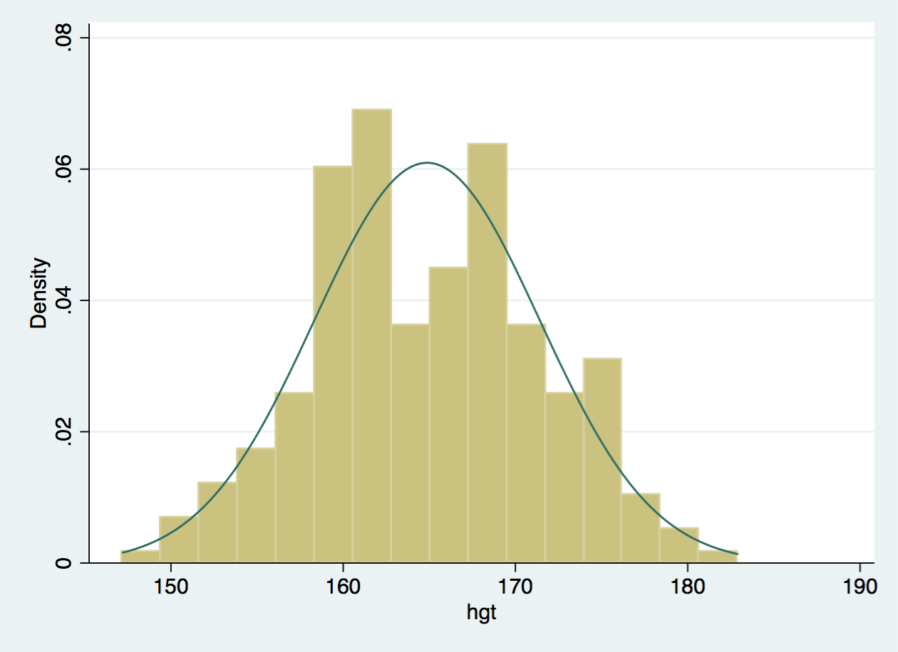
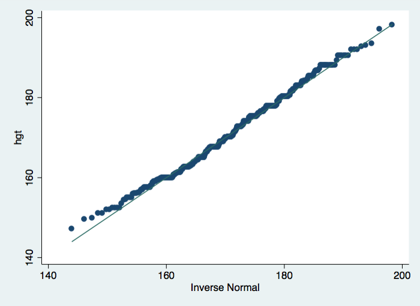
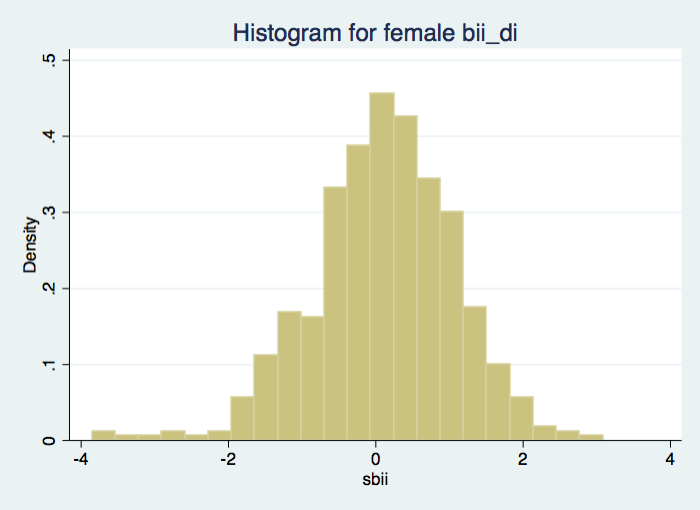
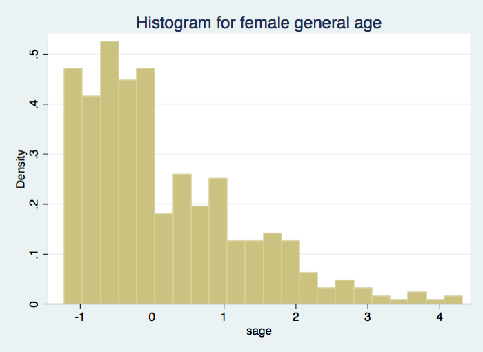
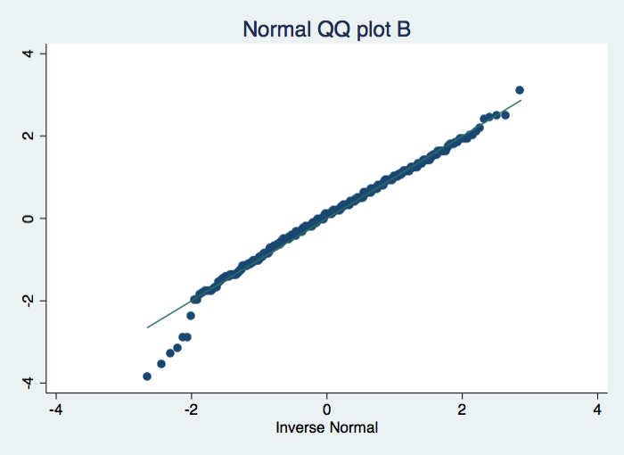

In this lab we'll investigate the probability distribution that is most central
to statistics: the normal distribution.  If we are confident that our data are 
nearly normal, that opens the door to many powerful statistical methods.  Here 
we'll use the graphical tools of Stata to assess the normality of our data and also 
learn how to generate random numbers from a normal distribution.

## The Data

This week we'll be working with measurements of body dimensions from the dataset "bdims.dta".  Read your dataset into Stata using the methods described in the "Introduction to Stata" lab.

Once you have read in your dataset, open up the Data Browser in Stata to view the data.  This data set 
contains measurements from 247 men and 260 women, most of whom were considered 
healthy young adults. 

```{r global-options, include=FALSE}
library(dplyr)
library(ggplot2)
library(oilabs)
library(haven)
data(bdims)
dat = bdims
dat = as.data.frame(dat)
colnames(dat) = gsub("[.]", "_", colnames(dat))
write_dta(data = dat, path = "bdims.dta", version = 13)

library(statamd)
statapath = statamd::stata_engine_path()
profile_do(dataset = "bdims.dta")

knitr::opts_chunk$set(eval = FALSE, engine = "stata", 
                      engine.path = statapath, comment = "")
```


You'll see that for every observation we have 25 measurements, many of which are
either diameters or girths.  We'll be focusing on just three columns to get started: weight in kg (`wgt`), 
height in cm (`hgt`), and `sex` (1 indicates female, 2 indicates male). 

<!-- We see
that the variable `sex` is labeled with the label `sex`:

```{r dsex, eval = TRUE}
describe sex
```

We can see the values for this label:

```{r dlabsex, eval = TRUE}
label list sex
```

Since males and females tend to have different body dimensions, we will want to 
be able to subset the data based on sex.  We can do this using and `if` statement and 
can use the numbers of the label.  Let's count the number of 
each sexes:


```{r counts, eval = TRUE}
count if sex == 1
count if sex == 2
```


If we don't remember which category is `1` or `2`, but remebmer the labels, we can
subset based on the label itself:

```{r counts_lab, eval = TRUE}
count if sex == "f":sex
count if sex == "m":sex
```


In order to doing thing separately, we can `preserve` the data, which makes a type of
checkpoint.  We can then manipulate the data, dropping variables or rows, and performing 
operations  When we want to go back to the checkpoint where we `preserve`d the data,
we use the `restore` command to get back.

Here we show how many cases there are, preserve the data set, keep only the females,
show that the data has fewer rows, restore the data, and show the original, full
data set is loaded back. 

```{r preserve_restore, eval = TRUE}
count
preserve
keep if sex == "f":sex
count
restore
count
```

-->


1.  Make a plot (or plots) to visualize the distributions of men's and women's heights.  
    How do their centers, shapes, and spreads compare?

## The normal distribution

In your description of the distributions, did you use words like *bell-shaped* 
or *normal*?  It's tempting to say so when faced with a unimodal symmetric 
distribution.

To see how accurate that description is, we can plot a normal distribution curve 
on top of a histogram to see how closely the data follow a normal distribution. 
This normal curve should have the same mean and standard deviation as the data. 
We'll be working with women's heights, so let's subset our data using the command `keep`.  We can always use the command `use "bdims.dta"` to go back to the original dataset of both females and males.

```{r female-hgt-mean-sd, eval = TRUE}
keep if sex == 1
```

Recall that we can display a histogram of the heights of females using the `histogram` command:

```{r hist-female, eval = FALSE, echo = 2}
keep if sex == 1
histogram hgt
```

Instead of plotting a *frequency* histogram, the default in Stata, we can plot a *density* histogram:

```{r hist-female-den, eval = TRUE, echo = 2, results = "hide"}
keep if sex == 1
histogram hgt, density
graph export hgt.png, replace
```



The difference between a 
frequency histogram and a density histogram is that while in a frequency 
histogram the *heights* of the bars add up to the total number of observations, 
in a density histogram the *areas* of the bars add up to 1. The area of each bar
can be calculated as its height *times* the width of the bar. Using a 
density histogram allows us to properly overlay a normal distribution curve over
the histogram since the curve is a normal probability density function that also
has area under the curve of 1. Frequency and density histograms both display the
same exact shape; they only differ in their y-axis. You can verify this by
comparing the frequency histogram and the density
histogram.


We can add a normal curve to this histogram by using the option `normal`.  

```{r hist-height, eval = TRUE, echo = 2, results = "hide"}
keep if sex == 1
histogram hgt, normal density
```


2.  Based on this plot, does it appear that the data follow a nearly normal 
    distribution?


## Evaluating the normal distribution

Eyeballing the shape of the histogram is one way to determine if the data appear
to be nearly normally distributed, but it can be frustrating to decide just how 
close the histogram is to the curve. An alternative approach involves 
constructing a normal probability plot, also called a normal Q-Q plot for 
"quantile-quantile".

```{r qq, eval = TRUE, echo = 2, results = "hide"}
keep if sex == 1
qnorm hgt
graph export qqhgt.png, replace
```




The x-axis values correspond to the quantiles of a theoretically normal curve with mean and standard deviation equal to the sample mean and standard deviation from the data.  The y-axis values correspond to the quantiles of the sample data. A data set that is nearly normal will result in a probability plot where the points closely follow a diagonal line.  Any deviations from normality leads to deviations of these points from that line. 

The plot for female heights shows points that tend to follow the line but with some errant points towards the tails.  We're left with the same problem that we encountered with the histogram above: how close is close enough? 

A useful way to address this question is to rephrase it as: what do probability plots look like for data that I *know* came from a normal distribution?  We can answer this by simulating data from a normal distribution.  First, we need to find the mean and standard deviation of our heights:

```{r, eval = FALSE, echo = 2}
keep if sex == 1
summarize hgt
```


Then, using this mean and standard deviation, we can simulate normal data into a new variable called `simnorm` using the function `rnormal`.


```{r, eval = TRUE, results = "hide"}
generate simnorm = rnormal(164.9, 6.5)
```


We can take a look at the shape of our simulated data as well as its normal probability plot. 

3.  Make a normal probability plot of `simnorm`.  Do all of the points fall on the line?  How does this plot compare to the probability plot for the real data?

4.  Does the normal probability plot for female heights look similar to the plots created for the simulated data?  That is, do the plots provide evidence that the female heights are nearly normal? 
5.  Using the same technique, determine whether or not female weights appear to come from a normal distribution. 

## Normal probabilities

Okay, so now you have a slew of tools to judge whether or not a variable is normally distributed.  Why should we care?

It turns out that statisticians know a lot about the normal distribution.  Once we decide that a random variable is approximately normal, we can answer all sorts of questions about that variable related to probability.  Take, for example, the question of, "What is the probability that a randomly chosen young adult female is taller than 6 feet (about 182 cm)?" (The study that published this data set is clear to point out that the sample was not random and therefore inference to a general population is not suggested.  We do so here only as an exercise.)

If we assume that female heights are normally distributed (a very close approximation is also okay), we can find this probability by calculating a Z-score and consulting a Z table (also called a normal probability table).  In Stata, this is done in two steps.  First, we compute the Z-score in the same way discussed in the textbook, using Stata as a calculator.  

```{r zscore, eval = TRUE}
display (182 - 164.9) / 6.5
```

Then, with the function `normal()`, we can find the *left-tail* probability, which corresponds to an adult female being *smaller* than 182 cm:


```{r prob, eval = TRUE}
display normal(2.63)

```

If we want the *right-tail* probability for an adult female being taller than 182 cm, we take:

```{r probinv, eval = TRUE}
display 1 - normal(2.63)
```


Assuming a normal distribution has allowed us to calculate a theoretical probability.  If we want to calculate the probability empirically, we simply   need to determine how many observations fall above 182 then divide this number by the total number of females in the sample. 

```{r count, echo = c(2)}
keep if sex == 1
count if hgt > 182
```

Although the probabilities are not exactly the same, they are reasonably close.  The closer that your distribution is to being normal, the more accurate the theoretical probabilities will be.

6.  Write out two probability questions that you would like to answer; one regarding female heights and one regarding female weights.  Calculate those probabilities using both the theoretical normal distribution as well as the empirical distribution (four probabilities in all).  Which variable, height or weight, had a closer agreement between the two methods? 

* * * 

## More Practice

7.  Now let's consider some of the other variables in the body dimensions data set.  Using the figures at the end of the exercises, match the histogram to its normal probability plot.  All of the variables have been standardized  (first subtract the mean, then divide by the standard deviation), so the units won't be of any help.  If you are uncertain based on these figures, generate the plots in Stata to check. 

**a.** The histogram for female biiliac (pelvic) diameter (`bii_di`) belongs to normal probability plot letter ____. 

**b.** The histogram for female elbow diameter (`elb_di`) belongs to normal probability plot letter ____. 

**c.** The histogram for general age (`age`) belongs to normal probability plot letter ____. 

**d.** The histogram for female chest depth (`che_de`) belongs to normal probability plot letter ____. 

8.  Note that normal probability plots c. and d. have a slight stepwise pattern. Why do you think this is the case? 

9.  As you can see, normal probability plots can be used both to assess normality and visualize skewness.  Make a normal probability plot for female knee diameter (`kne_di`).  Based on this normal probability plot, is this variable left skewed, symmetric, or right skewed?  Use a histogram to confirm your findings. 

```{r hists-and-qqs, echo = FALSE, eval = TRUE, results = "hide"}
summarize bii_di
generate sbii = (bii_di - 27.58154) / 2.307476 
summarize elb_di
generate selb = (elb_di - 12.36692) / .8363728
summarize age
generate sage = (age -  28.76923) / 8.85319 
summarize che_de
generate sche = (che_de -  17.72462) / 1.832064 
histogram sbii, title("Histogram for female bii_di")
graph export histbii.png, replace

histogram selb, title("Histogram for female elb_di")
graph export histelb.png, replace

histogram sage, title("Histogram for female general age")
graph export histage.png, replace

histogram sche, title("Histogram for female che_de")
graph export histche.png, replace

qnorm sbii, ytitle("") title("Normal QQ plot B")
graph export qqb.png, replace

qnorm selb, ytitle("") title("Normal QQ plot C")
graph export qqc.png, replace

qnorm sage, ytitle("") title("Normal QQ plot D")
graph export qqd.png, replace

qnorm sche, ytitle("") title("Normal QQ plot A")
graph export qqa.png, replace

```











<div id="license"> This is a product of OpenIntro that is released under a [Creative Commons Attribution-ShareAlike 3.0 Unported](http://creativecommons.org/licenses/by-sa/3.0).  This lab was adapted for Stata by Jenna R. Krall and John Muschelli and adapted for OpenIntro by Andrew Bray and Mine &Ccedil;etinkaya-Rundel  from a lab written by Mark Hansen of UCLA Statistics.
</div>
